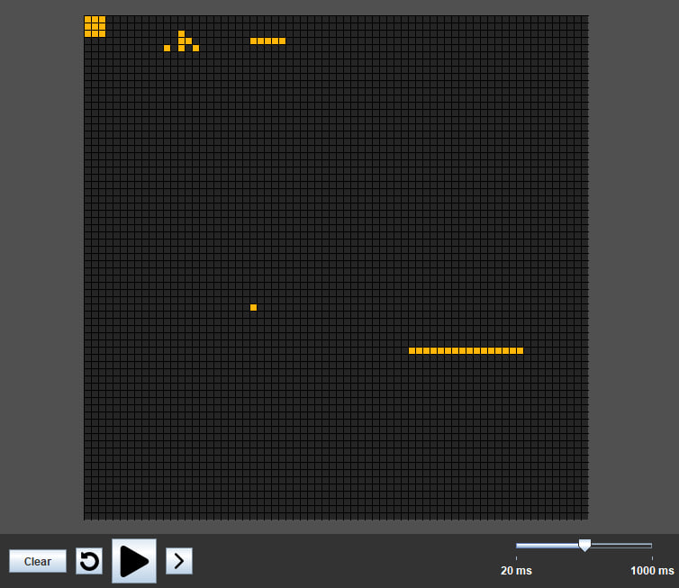

# Conway's Game of Life

Game of Life implementation in Java using `java.swing`

## Description

This project is work in progress. It is not yet polished and some features are not implemented.

## UI



To control the game you can use panel with buttons at the bottom of the window.
You can start and stop the simulation or run it step by step. You can also clear the field and reset it to its initial state.
All of these actions have keys attached to them:
- ```Space``` - start/stop
- ```Enter``` - step
- ```R``` - reset
- ```C``` - clear

## Config

You can create your own initial state of the game with text file
(there is example called ```config-example.txt```)

The rules of making config are:

- define ROWS and COLS whuck are dimensions of the grid
- define CHUNKS as list of objects in curly braces
- every object must contain ROW, COL and CHUNK which are position and layout of some part of the grid
- CHUNK must be defined as sequence of dots (```'.'```) and stars (```'*'```) surrounded with quotes (```'"'```)
- dots are dead cells and stars are alive ones
- the sequence must have rectangular form where rows are separated with newlines

config-example.txt:
```
ROWS = 70
COLS = 70

CHUNKS = [
{
ROW = 0
COL = 0
CHUNK = "..................................
         ..................................
         .............*....................
         .............**........*****......
         ...........*.*.*..................
         .................................."
}
{
ROW = 0
COL = 0
CHUNK = "***
         ***
         ***"
}
{
ROW = 45
COL = 45
CHUNK = "................
         ****************
         ................"
}
]
```


